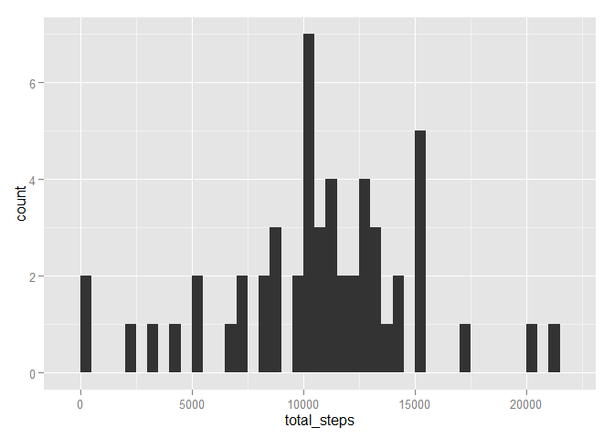

# Reproducible Research: Peer Assessment 1


```r
library(ggplot2)
```


### Loading and preprocessing the data

```r
unzip('activity.zip')
activity <- read.csv('activity.csv')
activity$date <- as.POSIXct(activity$date, format="%Y-%m-%d")
```

### What is mean total number of steps taken per day?

Let us start by:

* calculating the total number of states per day.
* plotting the histogram of the total number of steps taken per day.
* calculating the mean and median of the total number of steps taken per day.


```r
steps_per_day <- data.frame(total_steps = tapply(activity$steps, activity$date, sum))

ggplot(steps_per_day, aes(total_steps)) + geom_histogram(binwidth = 500)
```

 

```r
mean(steps_per_day$total_steps, na.rm = TRUE)
```

```
## [1] 10766.19
```

```r
median(steps_per_day$total_steps, na.rm = TRUE)
```

```
## [1] 10765
```
  
  
### What is the average daily activity pattern?


### Imputing missing values


### Are there differences in activity patterns between weekdays and weekends?
