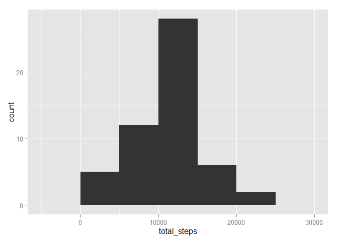
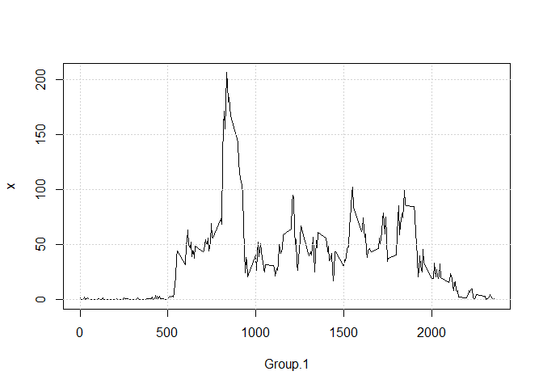

# Reproducible Research: Peer Assessment 1


#### Downloading, reading, and formating the data.


```r
unzip('activity.zip')
activity <- read.csv('activity.csv')
activity$date <- as.POSIXct(activity$date, format="%Y-%m-%d")
```

### What is mean total number of steps taken per day?

* First, we calculate the total number of states per day.


```r
steps_per_day <- data.frame(total_steps = tapply(activity$steps, activity$date, sum))
```

* Next, we plot the histogram of the total number of steps taken per day.


```r
ggplot(steps_per_day, aes(total_steps)) + geom_histogram(binwidth = 500)
```

 

* Finally, we calculate the mean and median of the total number of steps taken per day.


```r
mean <- mean(steps_per_day$total_steps, na.rm = TRUE)
median <- median(steps_per_day$total_steps, na.rm = TRUE)
```
  
The mean is 1.0766189\times 10^{4}, and the median is 10765.

### What is the average daily activity pattern?

To answer this question, we make a time series plot of the 5-minute interval (x-axis) and the average number of steps taken, averaged across all days (y-axis).


```r
steps_per_interval <- aggregate(activity$steps, list(activity$interval),
                                mean, na.rm = TRUE)
plot(steps_per_interval, type = 'l')
grid()
```

 

From this data, we can also answer the following question:
Which 5-minute interval, on average across all the days in the dataset, contains the maximum number of steps?


```r
max_interval <- steps_per_interval$Group.1[which(steps_per_interval$x == max(steps_per_interval$x))]
```

So it appears that interval 835 is the maximum.

### Imputing missing values

Here, we will clean missing days that may introduce bias into some calculations or summaries of the data.

1. Calculate and report the total number of missing values in the dataset (i.e. the total number of rows with `NA`s)


```r
sum(is.na(activity))
```

```
## [1] 2304
```

2. Devise a strategy for filling in all of the missing values in the dataset. The strategy does not need to be sophisticated. For example, you could use the mean/median for that day, or the mean for that 5-minute interval, etc.

3. Create a new dataset that is equal to the original dataset but with the missing data filled in.

4. Make a histogram of the total number of steps taken each day and Calculate and report the **mean** and **median** total number of steps taken per day. Do these values differ from the estimates from the first part of the assignment? What is the impact of imputing missing data on the estimates of the total daily number of steps?

### Are there differences in activity patterns between weekdays and weekends?
