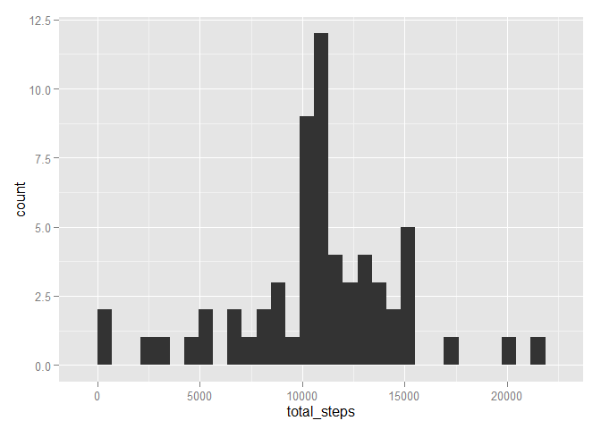

# Reproducible Research: Peer Assessment 1


#### Downloading, reading, and formating the data.


```r
unzip('activity.zip')
activity <- read.csv('activity.csv')
activity$date <- as.POSIXct(activity$date, format="%Y-%m-%d")
```

### What is mean total number of steps taken per day?

* First, we calculate the total number of states per day.


```r
steps_per_day <- data.frame(total_steps = tapply(activity$steps, activity$date, sum))
```

* Next, we plot the histogram of the total number of steps taken per day.


```r
ggplot(steps_per_day, aes(total_steps)) + geom_histogram(binwidth = 500)
```

 

* Finally, we calculate the mean and median of the total number of steps taken per day.


```r
mean_ <- mean(steps_per_day$total_steps, na.rm = TRUE)
median <- median(steps_per_day$total_steps, na.rm = TRUE)
```
  
The mean is 1.0766189\times 10^{4}, and the median is 10765.

### What is the average daily activity pattern?

To answer this question, we make a time series plot of the 5-minute interval (x-axis) and the average number of steps taken, averaged across all days (y-axis).


```r
steps_per_interval <- aggregate(activity$steps, list(activity$interval),
                                mean, na.rm = TRUE)
plot(steps_per_interval, type = 'l')
grid()
```

 

From this data, we can also answer the following question:
Which 5-minute interval, on average across all the days in the dataset, contains the maximum number of steps?


```r
max_interval <- steps_per_interval$Group.1[which(steps_per_interval$x == max(steps_per_interval$x))]

max_interval
```

```
## [1] 835
```

Interval 835 is the maximum.

### Imputing missing values

Here, we will clean missing days that may introduce bias into some calculations or summaries of the data.

1. We calculate and report the total number of missing values in the dataset (i.e. the total number of rows with `NA`s)


```r
sum(is.na(activity))
```

```
## [1] 2304
```

2. Next, we will make use the 5-minute interval means we calculated above to fill in the missing values.

3. Additionally, we will create a new dataset that is equal to the original dataset but with the missing data filled in.


```r
new_activity <- activity

for(i in 1:nrow(activity)) {
  if(is.na(activity$steps[i])) {
    new_activity$steps[i] <- steps_per_interval$x[which(activity$interval[i] == steps_per_interval$Group.1)]
  }
}
```

4. Finally, we make a histogram of the total number of steps taken each day and report the **mean** and **median** total number of steps taken per day. 


```r
new_steps_per_day <- data.frame(total_steps = tapply(new_activity$steps, new_activity$date, sum))

ggplot(new_steps_per_day, aes(total_steps)) + geom_histogram()
```

 


```r
new_mean <- mean(new_steps_per_day$total_steps)
new_median <- median(new_steps_per_day$total_steps)
```

The mean is 1.0766189\times 10^{4} and the median is 1.0766189\times 10^{4}.
From earlier, the mean and median of our data without replacing the missing values were 1.0766189\times 10^{4} and 10765, respectively.

The differences between the means is 0 and the difference between the medians is 1.1886792. So, there is a slight difference on the median values, but no difference in the mean values.

### Are there differences in activity patterns between weekdays and weekends?

1. To answer this question, we create a new factor variable in the dataset with two levels -- "weekday" and "weekend" indicating whether a given date is a weekday or weekend day.


```r
new_activity$weekdays <- weekdays(new_activity$date)

new_activity$weekdays[new_activity$weekdays == 'Monday' | new_activity$weekdays == 'Tuesday' | new_activity$weekdays == 'Wednesday' | new_activity$weekdays == 'Thursday' | new_activity$weekdays == 'Friday'] <- 'weekday'

new_activity$weekdays[new_activity$weekdays == 'Saturday' | new_activity$weekdays == 'Sunday'] <- 'weekend'
```

2. Now, we make a panel plot containing a time series plot of the 5-minute interval (x-axis) and the average number of steps taken, averaged across all weekday days or weekend days (y-axis).


```r
steps_per_int_wd <- aggregate(steps ~ interval + weekdays, FUN = mean, data = new_activity)

ggplot(steps_per_int_wd, aes(interval, steps)) + geom_line() + facet_grid(weekdays~.)
```

 
